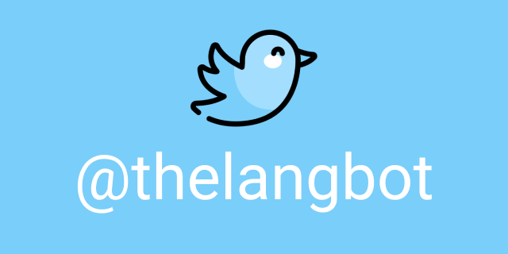

# thelangbot

## About
Twitter bot to help you learn foreign languages. Building a community through tweets. Retweets #100DaysOfLanguage and #langtwt.

https://maxdemaio.github.io/thelangbot/

## Translations
[Français](./translations/README_fr.md), [Italiano](./translations/README_it.md), [한국어](./translations/README_kr.md), [Ру́сский](./translations/README_ru.md), and [日本語](./translations/README_jp.md)

## Contributions

If you find a great resource that others would benefit from you can submit a pull request to add it to the repository. Also, feel free to tackle any open issues or new features! If you have any questions or ideas please feel free to reach out to me on Twitter: [@maxwelldemaio](https://twitter.com/maxwelldemaio).

------

## 100-days-of-language

### Two main rules
1. Study foreign language every day for the next 100 days.
2. Tweet your progress every day with the #100DaysOfLanguage hashtag.

### Publicly commit to the challenge
If you made the decision to commit to the challenge, click the link below to tweet it to the world, making yourself accountable and taking your resolve to the next level!

[Tweet to commit to the challenge!](https://twitter.com/intent/tweet?text=I%27m%20publicly%20committing%20to%20the%20100DaysOfLanguage%20Challenge%20starting%20today!%20Learn%20more%20and%20join%20me!%20Hey%20@thelangbot%20@maxwelldemaio%20&url=https://github.com/maxwelldemaio/100-days-of-language&hashtags=100DaysOfLanguage)

### Increasing success
Follow [@thelangbot](https://twitter.com/thelangbot) that retweets all the tweets that contain the #100DaysOfLanguage and #langtwt hashtag. It’s a great way to keep yourself motivated and to participate in the community. Optionally, make sure to take notes in a physical journal to reinforce learning concepts. You can download and use [100DayLog.txt](./languageLog/100DayLog.txt) to track your progress if you'd like.

Also, please encourage others who are posting their daily updates on their progress. Supporting others helps build and grow a community around positivity and that is helpful and effective. Plus, it's more likely that you will stick to your own commitment meeting new friends along the way!

------

## References
- Icon made by: [Freepik](https://www.freepik.com) from [www.flaticon.com](https://www.flaticon.com/)
- Inspiration of this challenge: [100DaysOfCode](https://www.100daysofcode.com/)
